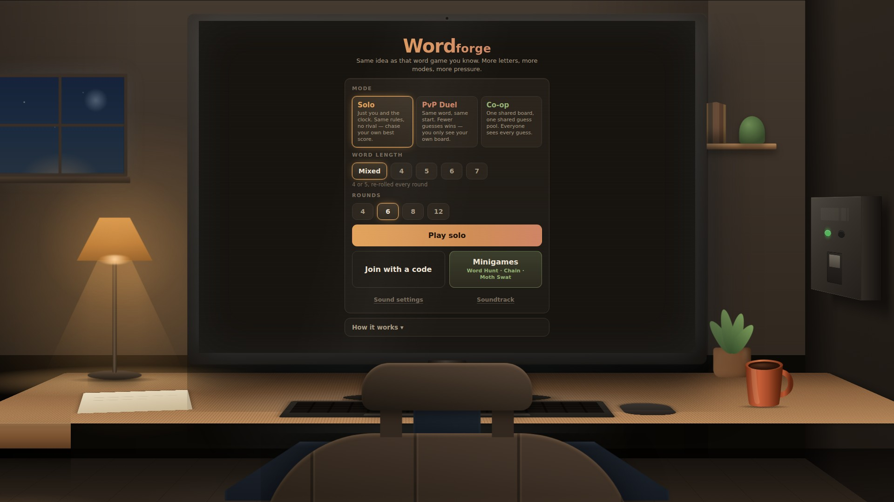
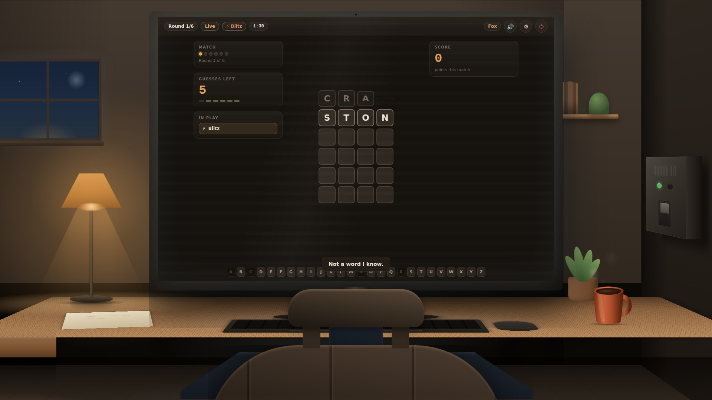
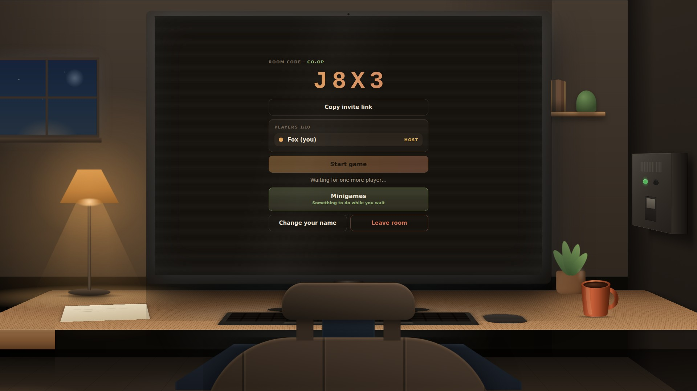
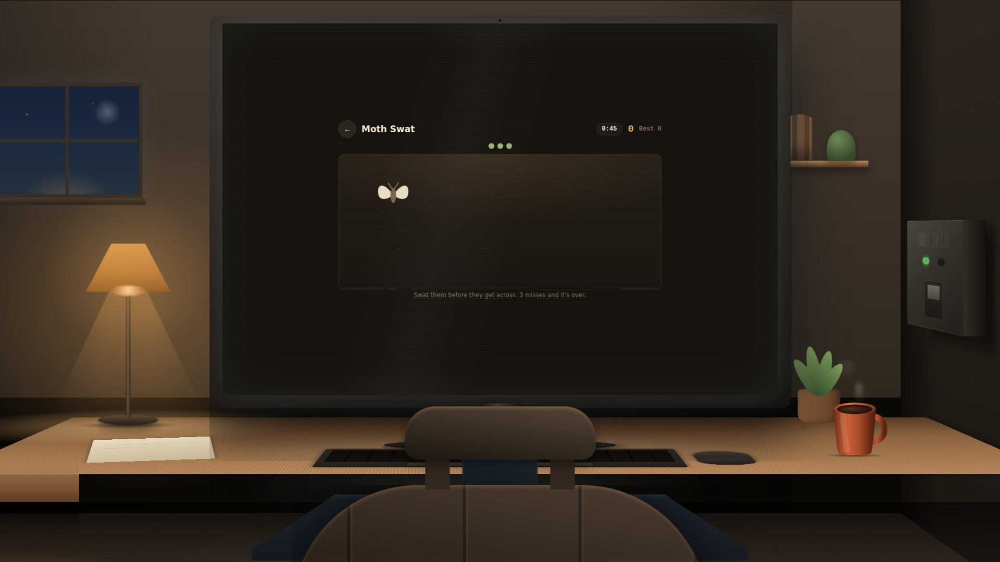
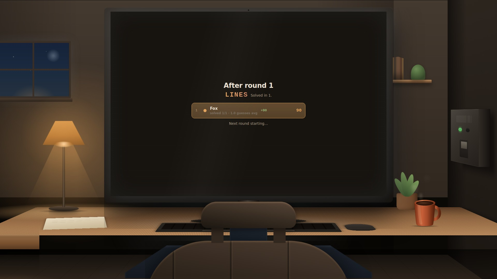
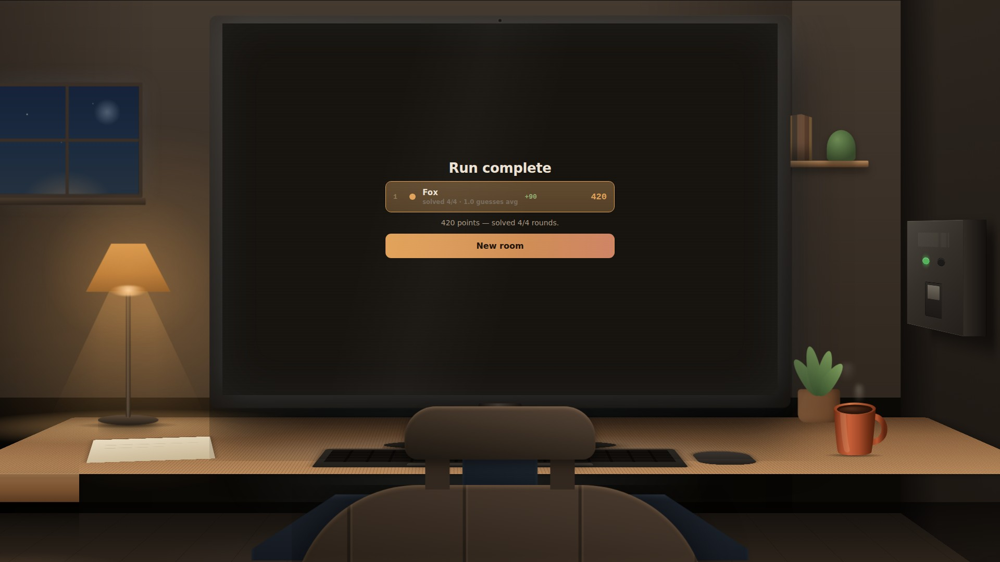
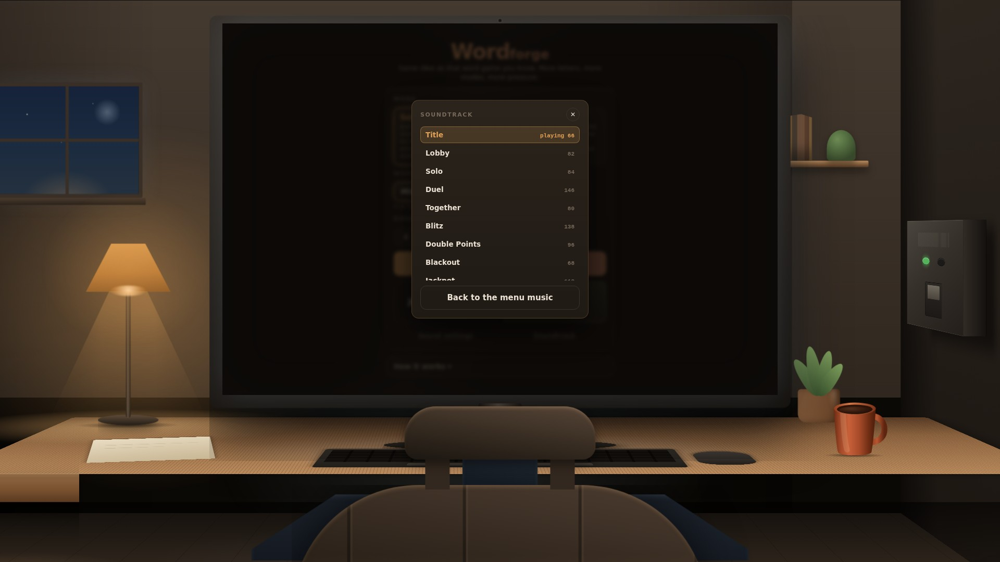

# Wordforge

A browser word game for 1–10 players. Guess the hidden word before your
guesses — or the clock — run out. Play alone, race up to four rivals for the
same word, or share one board with your whole team.

**Play: <https://sixsleet.github.io/Drift/>**

Plays on a desktop, a phone or a tablet, and the same room takes all three at
once — the platform someone joins on is nobody else's business. See
[Playing on a phone](#playing-on-a-phone).

<p align="center">
  
  
  
  
  
  
</p>
<p align="center">
  
</p>

---

## The basics

You get a hidden word and a budget of guesses. Type a real word of the right
length and press Enter. Each letter comes back as one of three things:

| Tile | Meaning |
| --- | --- |
| 🟩 **Hit** | Right letter, right place |
| 🟨 **Present** | Right letter, wrong place |
| ⬛ **Miss** | Not in the word |

A guess that lands nothing at all gets its own shake and sting. Every letter
you have ruled out greys out in the legend under the board, so you never
waste a guess retyping one.

Every round has a **5-minute clock**. Run out and the round ends there, word
revealed, unsolved.

## Modes

- **Solo** — just you and the clock. Same rules and the same guess budget as
  your seat in a live match.
- **Versus** — up to five players race the same word at the same time. You
  only ever see your own board; one bar per rival shows how many guesses each
  of them has burned and nothing else. **First to solve it wins the round**,
  however many guesses it took — so there is no reason to wait.
- **Co-op** — the whole room shares one board and one guess pool. Anyone can
  play the next guess. Coordinate, or waste attempts.

## Setting up a match

Pick the **word length** before you create the room: 4, 5, 6, 7, or Mixed
(4 or 5, re-rolled each round). It is fixed for the whole match, and anyone
who joins inherits it.

Then pick the number of **rounds** — 4, 6, 8 or 12. Points build across all
of them, and whoever has the most at the end wins.

Pick the **language** too. It does two things at once, on purpose: it sets
the language of the interface — yours alone, remembered in your browser, so
two people at the same table can read the game in two different languages —
and it sets the language of the *words* in any room you go on to create.
Joining somebody else's room does not change your menus; you keep them and
guess in whatever the room was made in.

**Guess budgets** are word length + 2 in Solo and Versus, and word length + 3 in
Co-op — no bigger a pool just because you invited more people.

## Scoring

```
points = max(0, guesses allowed − guesses used + 1) × 10
```

Plus a speed bonus in Solo and Versus (+20 for a near-instant solve, +10 for a
quick one), and doubled if the round rolled Double Points. Co-op scores the
same way off the shared attempt count and splits it across the team.

## The chain

From round 2 on, the secret usually has to **start with the last letter of
the previous round's word** — so you cannot lean on one memorised opening
guess all match. Watch the badge in the HUD. If no word of the right length
starts with that letter, the constraint quietly drops for that round.

## Round events

About three rounds in five roll one, announced full-screen for the whole
5-second countdown so nobody misses it.

Three of them move a number. The other six **change the rules of the round**
— what the board tells you, what you are allowed to type, when the round
ends, and what it is worth.

| Event | Odds | What it does |
| --- | --- | --- |
| 💰 Double Points | 10% | The round pays double |
| ⚡ Blitz | 10% | The clock is cut to 90 seconds |
| 🙈 Blackout | 7% | The legend stops greying out letters you have ruled out |
| 🔢 **Cipher** | 6% | No colours at all — you are told only *how many* hits and presents |
| 🔒 **Lockdown** | 6% | Every guess must reuse every letter you have confirmed |
| 🩸 **Sudden Death** | 6% | A guess that scores **nothing at all** puts you out for the round |
| 🫥 **Fading Ink** | 6% | Colours drain off each row seconds after it lands |
| 🚫 **Banned Letter** | 5% | One letter is outlawed for the whole round |
| 🎰 **Jackpot** | 2% | An extra guess **and** double points |
| 🎲 **Wager** | 2% | Stake your points on solving this one |
| *(none)* | 40% | An ordinary round |

### The six that change the rules

**🔢 Cipher.** The tiles keep your letters and lose their colours entirely.
Instead each row gets two numbers: how many letters are in the right place,
and how many are in the word but somewhere else. Which ones is up to you.
This is Mastermind grafted onto a word game, and it is the hardest thing in
the set.

**🔒 Lockdown.** Once the board has confirmed a letter, you are stuck with
it: greens stay where you found them, and every yellow has to appear
somewhere in every later guess. Illegal guesses are refused before they are
spent, so the modifier costs you options rather than attempts.

**🩸 Sudden Death.** A guess that comes back completely empty — not one of
its letters anywhere in the word — puts you out for the rest of the round.
Not "no greens", which happens on most openers; a total miss. It turns a
probing guess from something that costs an attempt into something that can
cost you everything, and it makes playing safe a real strategy for once. In
Co-op it eliminates only the player who threw it: the rest of the team keeps
going on the shared board, and the round ends when the word is found, the
clock runs out, or everybody is out.

**🫥 Fading Ink.** Each row keeps its colours for about eight seconds and
then loses them, letters left behind. The legend forgets along with the
board, so there is nowhere to look it up — you have to actually hold the
deductions in your head. Nothing is hidden from you; you just have to be
paying attention when it arrives.

**🚫 Banned Letter.** One letter is outlawed for the whole round and guesses
containing it are refused before they are spent. It is picked from letters
that are **not** in the answer, so the round is always winnable — it just
takes your favourite opener away from you.

**🎲 Wager.** During the countdown you stake 25, 50 or 100 of your points on
solving the round. Solve it and you win the stake; fail and you lose it. You
can never stake more than you have actually banked, so the worst case is
losing what you earned rather than going into debt. It never comes up on
round one, when nobody has anything to bet.

## Mid-round modifiers

A round can also spring a **second** modifier on you partway through, rather
than announcing it up front. Double points from here on, the remaining clock
halved, the legend going dark, or — in Co-op only — a 🔀 **Letter Swap**,
which makes two players' guesses trade tiles.

These are global: everyone in the room gets the same one at the same moment,
and it is announced to all of you.

## Your room

Meanwhile the room you are sitting in carries on without you.

| | |
| --- | --- |
| 🐈 **Cat** | Climbs onto the desk and sits down in front of the monitor, covering the bottom of the board. Click to move it |
| 🦋 **Moth** | Settles on a letter you have already earned and blurs it out. Swat it to get the letter back |
| 🐭 **Field mouse** | Darts across the floor. Click to shoo it, or it's gone in a couple of seconds regardless |
| 🕷 **Spider** | Comes down on a thread in front of the screen. Click and it climbs back up |
| 📱 **Phone** | Buzzes on the desk. Click to silence it |
| ✈️ **Paper plane** | Sails across the room. Catch it in flight, or it lands off screen |
| 🍃 **Falling leaf** | Drifts down off the desk plant. Catch it before it lands, or it settles and fades |
| 🔊 **Neighbour** | Music through the wall, and the soundtrack changes with it. Bang on the wall twice to stop it |
| 💡 **Lamp** | The desk lamp stutters |
| 🖼 **Crooked frame** | One of the wall frames goes crooked for a while, then straightens itself out |
| ✨ **Firefly** | A mote of light wanders through the lamp's glow and out again |
| 🚗 **Headlights** | A car passes outside; its lights sweep the back wall for a moment |
| 🐦 **Bird** | Lands on the sill outside. Nothing to do; it is just there |
| ⛈ **Thunderstorm** | Rain, lightning, and the lights going with it |
| 🐾 **Paw** | A paw comes up over the front edge of the desk and bats at nothing. Click to shoo it |
| 🌫 **Dust** | Motes turning over in the lamplight. Goes when the lamp does |
| 🛩 **Plane** | A light crossing the sky in the window, blinking, with a drone under everything |
| 🔧 **Pipes** | The heating knocks behind the wall. Nothing to see, which is the point |
| 🌬 **Gust** | Air finds the open sash and moves the curtain. Only if you have the window up |
| 📌 **Note** | One of the pinboard notes gives up on its pin and drops behind the desk |
| 🪰 **Fly** | Lands on your board and will not take the hint. Swat it and it dodges and lands somewhere else — three connected swats to be rid of it |

**These are yours alone.** Nobody else sees them, they change nothing about
the game, and the only cost is that they are in your way. Most can be cleared
with a click.

**The fly is the one that is meant to annoy you.** Everything else here costs
a glance, or one click. The fly does not go away the first time: it dodges,
buzzes, and lands somewhere else on your board. What it never does is cost you
the round — it does not cover a letter, it does not eat a click meant for
anything underneath it, and it gives up on its own after fifteen seconds
whether or not you ever hit it. Ignoring it entirely is always a valid answer.
What it takes is attention, which is what this game is actually made of.

**Two clocks, not one.** The events that cost you something — a cat on the
board, a phone to silence — arrive every 6 to 17 seconds. The ones that cost
you nothing run on their own clock beside them, closer together, so there is
usually something moving somewhere. A single queue at the old spacing meant
that a round solved in ninety seconds showed you one or two events and the
room read as empty. The two never stack up: at most one demanding thing is
in front of you at a time, the same event never runs twice at once, and the
quiet clock sits out anything that washes the whole screen.

## The power cut

One lightning strike per storm trips the breaker on the wall. The room goes
dark — all of it — and the only thing left is the red light on the fuse box.

**Click it to put the power back on.** Leave it ten seconds and something
comes out of the dark. The lights come back on their own after that.

The round clock keeps running the whole time.

## Minigames

Waiting in a lobby is the dullest part of any game, so there are three
things to do while you wait. They are worth nothing — no points, no bonuses,
no effect on any match — beyond a personal best kept in your own browser.

- **Word Hunt** — six letters; find every 4- and 5-letter word hiding in
  them. Fours score 1, fives score 3. `Tab` for new letters, at the cost of
  5 seconds.
- **Chain** — each word must start with the last letter of the one before,
  which is the rule that catches people out mid-match. `Tab` to pass.
- **Moth Swat** — they come faster as you go. Three get past you and it is
  over.

## Sound

Everything you hear is played by the game as you play it — there is no
recorded music anywhere in this repository, and no two rounds are the same.

**It is played on real instruments.** `assets/instruments/` holds about two
megabytes of recorded notes — a nylon-string guitar, an electric piano, an
upright bass, a fingered electric bass, a vibraphone, a string section, a
flute and a brass section, ten to sixteen notes each — and the engine picks
the nearest recorded note and shifts it into place. An oscillator through a
filter can imitate the *envelope* of a plucked string; it cannot imitate the
body resonating, the other strings ringing in sympathy, or a spectrum that
changes shape as the note decays. Those are recordings or they are nothing.

Sound effects are still synthesised — a cat, a doorbell and a breaker are
things a couple of oscillators are genuinely good at — and so are the drums
and the parts that are *supposed* to sound electronic: the Duel's hook,
Blitz, Moth Swat, and the neighbour's track coming through the wall.

Nothing about this blocks. The samples are fetched only once the sound is
actually on, each instrument loads once, and until one arrives its part is
played by the oscillator that used to play it. Offline, or on a connection
that gives up, the game sounds exactly like it did before rather than
falling silent.

**Each mode has its own soundtrack.** Solo is a quiet bed with nothing moving
over it, on purpose — anything with a tune in it pulls your eye off the word.
Versus is fast and driving, because somebody is racing you. Co-op is the calm
one and swings, which is what stops it being Solo in a different key.

**Every theme is arranged, not looped.** Each one is a running order rather
than a repeating bar: sections say how many bars they last and which parts you
can hear during them, so a theme opens on a pad, fills out, drops to just the
hats, and comes back. Seventeen of the twenty-one themes have one, and the
five you spend real time inside run one to two minutes before anything
repeats.

**And each has a bridge.** A section can change the chords under the same
tune, or lift the whole thing up a fourth, or step up a semitone for the last
four bars — which is the only way a piece of music actually goes somewhere.
Muting parts gets you dynamics; changing the harmony gets you a destination.

**Five written lines, not two.** Bass, lead, a counter-line that answers it
rather than doubling it, a harmony that shadows the tune at a fixed interval
in the key, and a solo that most sections keep muted so that the one section
which does not stands out. The leads are four bars — a phrase and its answer
— because two bars is a cell, and a cell repeated is what "looped" sounds
like.

**Nothing lands exactly on the grid.** Every note is nudged a few
milliseconds either way, every note is played at a slightly different
strength, and the beats are accented over the notes between them. The kick,
the snare and the hats each drift by a different amount, so the kit is not
one sample played three times. None of it is large enough to hear as
sloppiness and all of it is large enough that the second time round a bar is
not a photocopy of the first.

Where lines are deliberately different lengths — a 24-step comp against a
32-step lead — they only agree every three bars, which is most of why a long
round keeps sounding like it is going somewhere.

**And each minigame has its own**, as does everything that happens to you: the
blitz clock, a blackout, a jackpot, a letter swap, the storm, the power going
out, the neighbour's stereo, the standings between rounds, and winning or
losing. Twenty-one pieces of music in all, none of them the same as another.

**Play any of it from the main menu** — "Soundtrack" lists every track in
the game and plays whichever you pick. It hands the music straight back the
moment you leave the menu, so a lobby and a match sound like they should.

Music and effects have **separate volume sliders**, under the ⚙ in the HUD or
"Sound settings" on the title screen, and both are remembered.

**The themes are arranged, not looped.** Each one is a running order: a
number of bars with only the pad and bass, then the tune, then everything,
then a break where the lead drops out and the drums change. Solo runs 24
bars before anything repeats and Co-op 28 — and inside that the counter
melody is written in 48 steps against the lead's 32, so the two only line up
every third bar. Underneath there are written parts for bass, lead and a
counter line, and nine drum voices (kick, snare, rim, clap, closed and open
hats, shaker, tom, ride) each on their own pattern.

## The room, and switching bits of it off

The desk, the lamp, the window and everything on the shelf are CSS 3D — no
images, no canvas. Two things in it answer to you rather than to a timer:

**The lamp.** Click the shade to pull the switch. The whole room relights.
What is left is the monitor, which is the only other light in here, so the
room does not go black — it goes blue, which is what a room lit by a screen
actually looks like.

**The window.** Click it and the lower sash slides up. Night air comes in,
the curtain moves in it, and you can hear outside.

Both are remembered in your browser. The event scheduler knows about them
too: a lamp you have switched off has nothing to flicker and no light for a
moth to circle, so those events are taken out of the pool rather than firing
invisibly and turning your lamp back on. Same for a closed window and the
gust that would come through it.
## Joining, renaming and leaving

Create a room and share the four-character code, or the link — anyone
opening it drops straight into the code screen. Solo needs no room at all.

You get a name when you join. **Change it in the lobby** with "Change your
name" — up to 14 characters, and everyone else in the room sees it straight
away. It is fixed once the match starts, since by then it is attached to
guesses other people have already read.

**Leave** from the lobby, or with the ⏻ button in the HUD mid-match. What
happens to everyone else depends on when:

- **From the lobby**, your seat goes back into the pool for someone else.
- **Mid-match**, you keep your place in the standings — you earned those
  points — but you are marked as having left.
- **If you were the host**, the room is handed to whoever has been there
  longest, so it can still be started and advanced.
- **In Versus**, the round settles around you: someone who has left can
  neither solve it nor burn a guess, so it no longer waits on them. If that
  leaves a single player, they are taken to the final standings rather than
  left racing a rival who is not coming back.
- **In Co-op**, the match carries on with whoever is left.

## Languages

Five, fully translated — interface and word pools both:

| | Answers | Accepted guesses |
|---|---:|---:|
| 🇬🇧 English | 4,559 | 74,103 |
| 🇮🇹 Italiano | 3,066 | 32,618 |
| 🇩🇪 Deutsch | 3,802 | 26,485 |
| 🇪🇸 Español | 4,818 | 72,485 |
| 🇫🇷 Français | 3,416 | 55,811 |
| | **19,661** | **261,502** |

Two lists per language and per word length, and the difference matters:
**answers** is the small, frequency-filtered pool a secret is drawn from, so
you are never asked to guess a word you have not met; **accepted guesses** is
everything the game will let you type, deliberately much larger, because
being refused a word you know is the most annoying thing a word game can do
to you. Only the accepted-guess lists ship to the browser — the answer pools
live server-side in `wf_words` and are never deployed.

Both are built by `tools/build-words.mjs` from Hunspell dictionaries and
frequency lists (see the header of that file for the sources and the exact
filtering). Rerunning it is deterministic: same dictionaries in, same lists
out.

**Names are not answers.** A word the dictionary only ever knows capitalised
is a person, a place or a brand, and being asked to guess EMMA or LINUX is
not a word game — so those are filtered out of the answer pools. They stay
in the accepted-guess lists: never being *asked* to guess PARIS is fine,
being *refused* it when you type it is not.

**The chain never paints itself into a corner.** Because each round's answer
is the next round's first letter, a word ending in a letter almost nothing
starts with would strand the following round — and the no-repeat rule makes
that worse the longer a match runs. The picker prefers to end on letters
that have real depth behind them, falling back only if that leaves nothing.
Before this, French 4-letter matches broke the chain about once every two
games; measured over 400 simulated matches against the live word table
afterwards, they no longer break at all.

**Accents fold away.** The board, the letter legend and the scoring all
assume a 26-letter alphabet, so *café* is stored and played as CAFE and
*schön* as SCHON, in both lists alike. You can still *type* the accents —
pressing é puts down an E, à puts down an A — so you write the word the way
you would write it and the board spells it the way it stores it. German ß is
the one thing dropped rather than folded, since turning it into "ss" would
put two tiles down for one keystroke and change the word's length.

**Which language a room is in** is decided by whoever created it and shown
to everyone who joins — on the lobby line and as a flag in the left rail
during play. Your menus stay in your own language, so without that there
would be nothing on screen to tell you the words are Italian.

## Playing on a phone

The whole game, not a cut-down version of it: every mode, every round event,
the wager, the language picker, the minigames and the soundtrack. A phone can
host a room a desktop joins, and the other way round.

Two things change, and only because they have to.

**The keyboard.** On a desktop you type on the one on the desk, and the A–Z
strip under the board is a read-only note of which letters you have ruled
out. With a finger there is no such keyboard, so that same strip becomes one:
laid out QWERTY, with ⏎ and ⌫ on the ends of the bottom row. Merging the two
is the point rather than a compromise — the letters that have gone dark are
exactly the keys not worth pressing again. A physical keyboard keeps working
alongside it, so a tablet in a case keyboard can use either, in the same
round, without a setting.

Word Hunt does the same trick with its rack: the six letters you are allowed
to use are already on screen, so you tap those rather than hunt for them in a
grid where twenty keys do nothing.

**The room.** The desk, the monitor and the walls are geometry that needs a
wide screen, so below 1080px they are dropped and the app fills the display —
that part predates this. The room *events* still run: the cat still walks in
front of what you are reading, the lights still stutter, the storm still
takes over the music, and the power cut still puts a bat on your screen. The
ones that are pinned to furniture — the moth circling the lamp, a leaf past
the window, the spider coming down the wall — stay on desktop, because with
no lamp, window or wall drawn they would play out somewhere off the side of
the phone. They are not fired invisibly; the picker knows which is which.

## Licence

See `LICENSE`.
